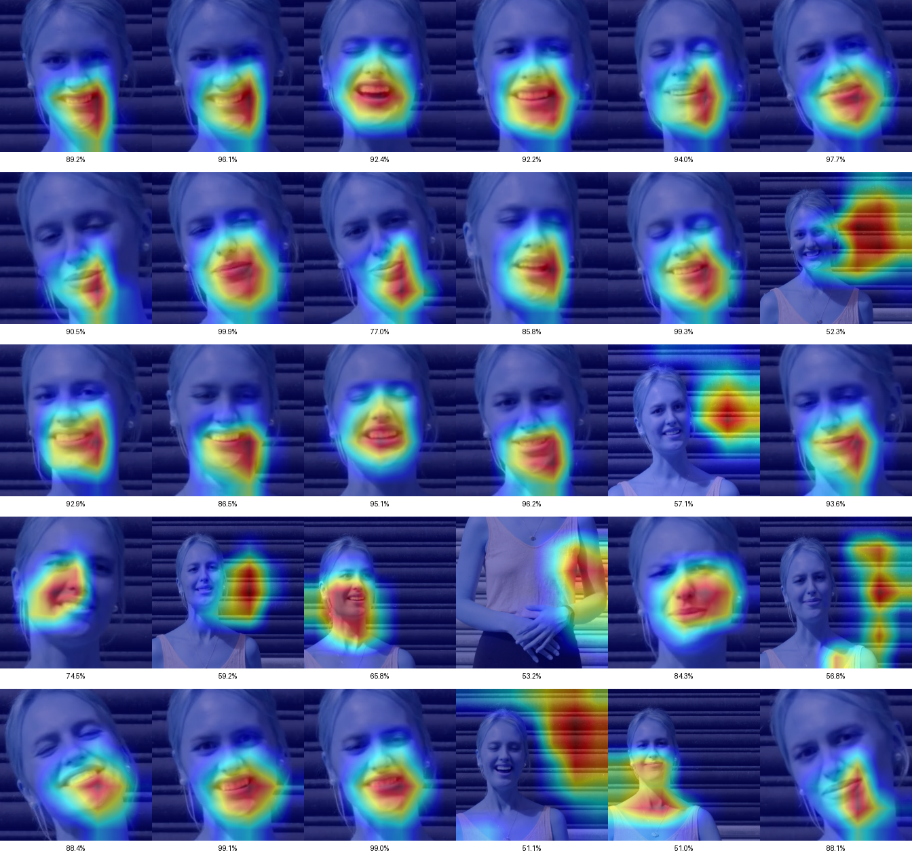

# Deep Fake Detection

## Table of Contents
- [Introduction](#introduction)
- [Dataset and Data Preparation](#dataset-and-data-preparation)
  - [Dataset Description](#dataset-description)
  - [Data Preparation](#data-preparation)
    - [No Crop](#no-crop)
    - [Crop to Faces](#crop-to-faces)
- [Models and Evaluation Method](#models-and-evaluation-method)
  - [General Training and Evaluation Setup](#general-training-and-evaluation-setup)
  - [ResNet50](#resnet50)
  - [Xception](#xception)
  - [Swin Transformer](#swin-transformer)
  - [Evaluation Method](#evaluation-method)
- [Results](#results)
  - [Results Analysis](#results-analysis)
  - [Selected ROC Curves and Analysis](#selected-roc-curves-and-analysis)
  - [Confusion Matrices and Analysis](#confusion-matrices-and-analysis)
  - [Heat Maps](#heat-maps)
- [Conclusions](#conclusions)
- [Data Sources](#data-sources)

---

## Introduction

Deepfakes are videos that have been manipulated using artificial intelligence to show people saying or doing things that never actually happened. This is achieved through specialized algorithms that “learn” how to change a person’s facial or voice characteristics in a highly realistic way.

In recent years, creating such altered videos has become easier and more widespread, leading to serious issues such as misinformation or damage to one’s public image.

The purpose of this work is to detect deepfake videos using deep learning techniques. Specifically, four different neural network models were studied and applied to a dataset containing both real and manipulated videos.

The work includes data preparation, model training, model evaluation, and comparison of results, aiming to identify which model is most effective at recognizing deepfake content.

---

## Dataset and Data Preparation

### Dataset Description

For training and evaluation, we used the **FaceForensics++** dataset, available on Kaggle. This version includes a total of 400 videos: 200 real and 200 fake. The videos are organized into two folders named `real` and `fake`, with durations ranging from 1.38 seconds up to 67.50 seconds.

### Data Preparation

Data preparation is a common starting point for all trained models. Regardless of whether we use full frames or face crops, the basic process is the same: each video is traversed to select a fixed number of frames (typically 30) that represent its temporal evolution in a representative way.

Sampling is performed at fixed temporal intervals: we compute the total number of frames in each video and then select 30 frames evenly spaced across its length. This ensures consistent coverage regardless of short or long videos.

After collecting frames for each video, we split the data into three subsets:
- Training (75%)
- Validation (12.5%)
- Test (12.5%)

The split is random but uses a fixed `random seed` to ensure reproducibility. Finally, each frame is passed through a series of image transforms, depending on whether it belongs to the training set or to the other two sets (where we do not use augmentations).

#### No Crop

The simplest approach is to use the entire frame as it appears in the video, without face detection. This makes the process faster and more stable, since it does not depend on face detection quality. Thus, even if the face is occluded, tilted, or missing entirely, the sample can still be used.

Frames are converted to RGB and then standard preprocessing is applied: resizing, cropping, random rotation, and color distortion (training-only). The hypothesis is that the model can detect deepfake cues not limited strictly to the face (e.g., neck deformations, odd lighting, artifacts in the background).

#### Crop to Faces

The “Crop to Faces” approach assumes that the most important signs of manipulation appear on the face itself. Therefore, before using a frame, we first attempt to detect the face.

Detection is performed on each frame using two tools:
1. **MediaPipe Face Detection**, with two internal models (`model_selection=0` and `1`).
2. **MTCNN**, as a fallback if the above fail.

If a face is found, we compute the bounding box, add a margin around it, and crop and resize to 224×224. If no face is detected, we try up to 5 times with another random frame from the same video. If still unsuccessful, we keep the entire frame (no cropping) and force-resize to the same size.

Cropped images are converted to tensors and undergo random transforms only in the training set (e.g., rotation, horizontal flip, color jitter), to increase generalization.

Combining face detection with dynamic augmentations helps models focus on regions that may betray manipulation. However, this approach is more sensitive to frame quality and slower due to detection checks.

---

## Models and Evaluation Method

### General Training and Evaluation Setup

All models use the `DeepFakeFrameDataset`, which extracts frames from videos and provides three `DataLoader`s: `train`, `val`, and `test`. In `train`, we apply augmentations such as rotation, random scaling, horizontal flip, and color jitter; in `val`/`test`, we only resize, convert to tensor, and normalize with fixed RGB means and standard deviations.

Training uses `batch size = 8` and `learning rate = 1e−4` with Adam. We enable mixed precision training (via `torch.cuda.amp` or `autocast` and `GradScaler`) for speed and memory savings. The loss is Cross-Entropy. We use a scheduler (`ReduceLROnPlateau`) to reduce the learning rate by 0.1 when the validation loss fails to improve for two consecutive epochs, and early stopping if there is no improvement for five consecutive epochs.

After each epoch:
1. Set the model to `eval()` and run all validation frames.
2. For each frame, collect probabilities and predictions.
3. Aggregate frame-level predictions to video-level using several methods:
   - `mean_prob`
   - `max_prob`
   - `median_prob`
   - `trimmed_mean_prob`
   - `vote_percentage`
4. For each method, compute accuracy, precision, recall, F1, Matthews correlation (MCC), AUC, Average Precision, and Equal Error Rate (EER).
5. Select as “best” the method with the highest F1; this is used at test time.
6. If the current validation loss is the best so far, save the weights.

When training completes (or early stops), we plot:
- train vs val loss per epoch
- train vs val accuracy per epoch
- validation F1 curve per epoch
- F1 vs validation loss

and save them as PNG files.

### ResNet50

ResNet50 is a popular convolutional neural network known for residual connections, which allow training very deep models without vanishing signal issues. Essentially, each block learns a residual (difference) between input and output, leading to faster and more stable training.

Here, we use a pretrained ResNet50 and adapt it for binary classification (real vs fake). We place a new fully-connected head at the end: a layer with 512 neurons, ReLU, dropout for regularization, and a final 2-unit output (one per class). During training, we “freeze” most of the original layers and only fine-tune the last layers, so the model learns deepfake-related features without forgetting general visual features learned pretraining.

### Xception

Xception is a CNN based on depthwise separable convolutions. Instead of combining spatial and channel-wise processing in a single convolution, Xception separates them: depthwise convolutions per channel, followed by pointwise 1×1 convolutions to mix channels. This yields higher efficiency and the ability to model complex relationships.

We use a pretrained Xception and extend it with an SE (Squeeze-and-Excitation) attention block, which dynamically reweights channels to emphasize the most critical features. We then add a simple fully-connected classifier predicting the final class (real or fake).

During training, most layers remain frozen; we unfreeze only the last blocks (block6, block7, block8) and the last conv layer, preserving general capabilities while adapting to deepfake detection.

### Swin Transformer

Swin Transformer processes images using attention rather than convolution. Unlike vanilla Vision Transformers, Swin splits the image into windows and applies self-attention locally within each window, which reduces compute and enables hierarchical representation learning similar to CNNs.

We use a pretrained Swin-Base and add an SE (Squeeze-and-Excitation) block to the final feature vector before the output, enhancing the most informative channels. Finally, we attach a small classifier head.

At first, almost all backbone layers are frozen except the classifier, the SE module, and the last Swin block. As training progresses, we gradually unfreeze more blocks (from layer 3 toward layer 1), so the model can adapt to deepfake detection without losing its generic prior.

### Evaluation Method

Evaluation considers not only frame-level accuracy but also video-level decisions, since each frame is only part of the whole. The final decision per video is derived by aggregating multiple frame predictions.

For each processed frame, we store the predicted label, softmax probability, and ground truth, grouped by video, so we can compute overall scores per video later.

Aggregation uses the method selected as “best” during training (mean of probabilities, max/min probability, median, trimmed mean, vote percentage).

Each aggregation method is evaluated with accuracy, precision, recall, F1, MCC, AP, and EER. We keep the one with the best F1 as the “optimal aggregation strategy” for that model.

Based on that optimal method, we also produce:
- the **confusion matrix**,
- the **ROC curve**,
- the **precision–recall curve**.

We also log results into two CSVs: one for correct predictions and one for errors. These files include the video name, number of frames, true and predicted labels, model confidence, and whether the outcome was TP, TN, FP, or FN.

For deeper interpretability, we generate **Grad-CAM images**. For four categories (TP, TN, FP, FN), we randomly pick 3 examples; for each video we create a composite image showing heatmaps for all selected frames. Heatmaps (via Grad-CAM) highlight where the network “looked” when making its decision.

This evaluation process is the same for face-cropped inputs and full-frame inputs; the only difference is whether face cropping is applied before inference.

---

## Results

This section presents the experimental results for **ResNet50**, **Xception**, and **Swin Transformer**. Each model is evaluated under four scenarios, depending on the training data type (`faces` or `frames`) and the test data type:

- Train on faces, test on faces (`faces → faces`)
- Train on faces, test on full frames (`faces → frames`)
- Train on frames, test on faces (`frames → faces`)
- Train on frames, test on frames (`frames → frames`)

For each model, we report performance in these four combinations. The rows include:

- **Aggregation**: the best frame→video aggregation method
- **Accuracy**: percentage of correct predictions
- **Precision**: fraction of predicted fakes that are truly fake
- **Recall**: fraction of true fakes that were found
- **F1-score**: harmonic mean of precision and recall
- **MCC**: Matthews correlation coefficient
- **AP**: Average Precision (area under precision–recall curve)
- **EER**: Equal Error Rate (FAR = FRR)

The tables below show detailed values for each combination.

### Model Results – ResNet50

| Metric            | faces→faces | faces→frames | frames→faces | frames→frames |
|-------------------|-------------|--------------|--------------|---------------|
| Aggregation       | mean_prob   | mean_prob    | max_prob     | max_prob      |
| Accuracy          | 0.7800      | 0.5400       | 0.4600       | 0.5400        |
| Precision         | 0.9286      | 0.5000       | 0.4412       | 0.5000        |
| Recall            | 0.5652      | 0.3478       | 0.6522       | 0.7826        |
| F1 Score          | **0.7027**  | 0.4103       | 0.5263       | 0.6102        |
| MCC               | 0.5863      | 0.0551       | -0.0551      | 0.1287        |
| Average Precision | 0.9099      | 0.6259       | 0.4791       | 0.4004        |
| EER               | 0.1852      | 0.3704       | 0.5926       | 0.5556        |

### Model Results – Xception

| Metric            | faces→faces | faces→frames | frames→faces | frames→frames |
|-------------------|-------------|--------------|--------------|---------------|
| Aggregation       | mean_prob   | mean_prob    | mean_prob    | mean_prob     |
| Accuracy          | 0.8400      | 0.6200       | 0.6100       | 0.5000        |
| Precision         | 0.8261      | 0.5000       | 0.5800       | 0.4667        |
| Recall            | 0.8261      | 0.3500       | 0.4500       | 0.6087        |
| F1 Score          | **0.8261**  | 0.4118       | 0.5068       | 0.5283        |
| MCC               | 0.6779      | 0.2100       | 0.3000       | 0.0164        |
| Average Precision | 0.9271      | 0.5400       | 0.6000       | 0.3915        |
| EER               | 0.1481      | 0.4700       | 0.4500       | 0.5556        |

### Model Results – Swin Transformer

| Metric            | faces→faces | faces→frames | frames→faces | frames→frames |
|-------------------|-------------|--------------|--------------|---------------|
| Aggregation       | median_prob | median_prob  | max_prob     | max_prob      |
| Accuracy          | 0.8000      | 0.5400       | 0.6600       | 0.4800        |
| Precision         | 0.7407      | 0.5000       | 0.5833       | 0.4595        |
| Recall            | 0.8696      | 0.5217       | 0.9130       | 0.7391        |
| F1 Score          | **0.8000**  | 0.5106       | 0.7119       | 0.5667        |
| MCC               | 0.6103      | 0.0771       | 0.3968       | -0.0018       |
| Average Precision | 0.7704      | 0.4639       | 0.5763       | 0.3867        |
| EER               | 0.2222      | 0.4074       | 0.3704       | 0.5185        |

### Results Analysis

**1) Comparison across models**  
In the `faces→faces` scenario (evaluation on cropped faces), Xception stands out with F1 = 0.8261, followed by Swin Transformer with 0.8000 and ResNet50 with 0.7027. AP and EER support this ordering: Xception achieves the highest AP (0.9271) and the lowest EER (0.0370), with ResNet50 following with AP = 0.9750 and EER = 0.1481.  
This indicates that Xception, thanks to depthwise separable convolutions and the SE block, is more effective at capturing fine-grained deepfake artifacts on faces.

**2) Comparison across experiments**  
All architectures perform best in `faces→faces`. When trained on faces but tested on full frames (`faces→frames`), performance drops (F1 ≃ 0.48–0.57), as the models never saw background context during training. In contrast, `frames→frames` improves prediction (F1 ≃ 0.61–0.65), suggesting better generalization to “real-world” videos with varied content. Notably, for Swin Transformer, `frames→faces` yields F1 = 0.7119, indicating attention-based features can transfer to facial patterns even when trained on full frames.

**3) Interpretation**  
The strong `faces→faces` performance shows that focusing on the face reduces background “noise” and peripheral artifacts, enabling better learning of true deepfake cues. However, generalizing to full frames (`faces→frames`) suffers without exposure to background patterns. Training and testing on frames (`frames→frames`) yields more balanced performance due to augmentations exposing the model to a broader variety of visual conditions.  
Xception excels on face crops due to sensitivity to pixel-level artifacts, while Swin Transformer is more flexible in cross-domain settings (`frames→faces`), likely thanks to self-attention capturing relationships among distant regions.

### Selected ROC Curves and Analysis

Below are three representative ROC curves—two “extremes” and the cross-domain case:

*Xception on `faces→faces` (AUC = 0.93).*

*ResNet50 on `faces→frames` (AUC = 0.65).*

*Swin Transformer on `frames→faces` (AUC = 0.65).*

**Interpretation**  
- **Xception (`faces→faces`, AUC = 0.97):** Excellent curve with high TPR and very low FPR across thresholds, confirming reliable learning of pixel-level deepfake features when focusing on the face.  
- **ResNet50 (`faces→frames`, AUC = 0.50):** Nearly diagonal curve indicating random prediction. ResNet50 does not generalize from crops to full-frame context without exposure to peripheral cues.  
- **Swin Transformer (`frames→faces`, AUC = 0.65):** Intermediate performance: self-attention captures some useful facial patterns even when trained on full-frame inputs, but not on par with Xception in the pure face-crop scenario.

These curves illustrate that:  
(a) Xception dominates in the controlled face-crop setting,  
(b) ResNet50 “collapses” under the crop→frame domain shift, and  
(c) Swin Transformer provides better generalization in the reverse shift.

### Confusion Matrices and Analysis

Two representative confusion matrices are shown below:

*Xception on `faces→faces` (mean_prob).*

*ResNet50 on `faces→frames` (mean_prob).*

**Interpretation**  
- **Xception (`faces→faces`):** Of 27 real faces, 24 were correctly classified (True Negatives) and only 3 were False Positives. Of 23 fake faces, 21 were detected (True Positives) and 2 were missed (False Negatives). This yields very high accuracy and recall, confirming Xception’s strength on cropped inputs.  
- **ResNet50 (`faces→frames`):** Of 27 real frames, only 12 were correct, while 15 were False Positives. Of 23 fake frames, 15 were True Positives and 8 were False Negatives. The uneven error distribution shows difficulty separating fake from real when the context shifts—motivating training on full frames or stronger augmentations.

### Heat Maps

Below are several heatmaps that help illustrate what the models “focus on.” Each composite image shows heatmaps for all selected frames from one video, plus the model’s “confidence” for each frame (probability of fake).

To understand where the model attends when deciding whether a frame is real or manipulated, we use **Grad-CAM**, which overlays a heatmap on the image. For each prediction, we inspect which internal channels (filters that detect edges, textures, shapes) were most activated, and use gradients to weigh their influence on the final decision. Regions that contributed most are highlighted with warm colors (red, orange), while regions of little influence remain cool (blue/black). Bright regions indicate where the model “looked” to judge authenticity—for instance, strong focus on the eyes or mouth suggests these features drove the decision.

We start with two examples from Xception. In the first, the video is indeed fake and the model correctly flags it; the attention concentrates on the mouth—the manipulated region. This experiment is `faces→faces` (trained and tested on faces).

*Grad–CAM heatmaps for a TP of Xception (`faces→faces`).*

In the second, the video is fake but Xception misses it, again in the `faces→faces` experiment. The manipulation is subtle and not clearly visible in single frames—the mouth exhibits a glitch only during playback, which static frames fail to capture well.

*Grad–CAM heatmaps for an FN of Xception (`faces→faces`).*

Finally, a ResNet50 example trained only on faces but tested on full frames (`faces→frames`). The model fails to even localize the face and instead relies on unrelated regions, explaining the poorer performance in this scenario.

*Grad–CAM heatmaps for an FN of ResNet50 (`faces→frames`).*

---

## Conclusions

We evaluated three models—ResNet50, Xception, and Swin Transformer—for deepfake video detection using selected frames. Each model was assessed in four scenarios depending on whether training/testing used face crops or full frames.

Key findings: input choice (faces vs frames) strongly affects performance. When training and testing on face crops, models reach F1 around 0.86–0.89, with Xception on top. In contrast, generalizing from crops to full frames is challenging (F1 ≈ 0.5). Training on full frames (`frames→frames`) yields more stable results (F1 ≈ 0.62), with augmentations covering a wider variety of conditions. Swin Transformer notably transfers part of its knowledge from full frames to faces (`frames→faces`, F1 ≈ 0.71) thanks to self-attention.

A main limitation is that frame-by-frame classification ignores motion information, leading to:
- artifacts that only appear across consecutive frames,
- generalization issues across frame rates or motion patterns,
- latency due to face detection per frame.

Potential improvements:
- sequence models (3D-CNN, LSTM, Video Transformers),
- multimodal cues (audio+video) to detect lip-sync artifacts,
- more flexible prediction aggregation (e.g., attention-based pooling).

Overall, results emphasize the need for temporal and multimodal information for robust deepfake detection in real videos.

---

## Data Sources

The dataset used is available at:  
[**FaceForensics++**](https://www.kaggle.com/datasets/greatgamedota/faceforensics)

